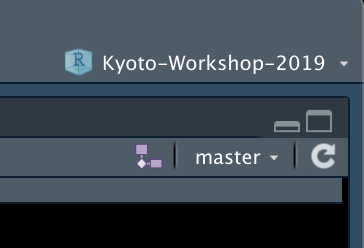

```{r setup, include=FALSE}
options(htmltools.dir.version = FALSE)
library(knitr)
opts_knit$set(root.dir = "..")
```


## 自己紹介

- 松尾晃孝 (Akitaka Matsuo)
- Postdoctraol Fellow at Institute for Data Science and Analytics (IADS) and Department of Government, University of Essex
- quanteda develope team member
    - core developer of [spacyr](https://spacyr.quanteda.io/)
- 専門: 政治学方法論、テキスト分析、議会政治、比較政治
- web: 
    - website: https://amatsuo.net
    - github: https://github.com/amatsuo


## 自己紹介

- 名前
- 所属
- テキスト分析への関心
    - 経験
    - 使いたいデータ

## 今日の予定

1. 自己紹介
1. 必要なソフトウェアのインストール
1. データをRに読み込む
2. Rデータをquanteda形式へと変換する
3. quantedaでテキスト分析: 記述統計
4. quantedaでテキスト分析: モデルを使って分析
1. (おまけ) Word vectorの推定


## 必要なソフトウェアのインストール


-	R, RStudio (https://qiita.com/hujuu/items/ddd66ae8e6f3f989f2c0)
- r-packages
    - tidyverse
    - quanteda (https://quanteda.io/articles/pkgdown/quickstart_ja.html)
    - caret (machine learning utility)
    - e1071
    - DT (html table generation)


## 必要なソフトウェアのインストール

1. R: 統計分析ソフトウェア
2. RStudio: 
    - Rを使うための統合開発環境
    - 事実上のスタンダード


## 必要なパッケージ

1. tidyverse
    - https://www.tidyverse.org/
    - "The tidyverse is an opinionated collection of R packages designed for data science."
    - インストールコマンド
    ```{r eval=FALSE}
    install.packages("tidyverse")
    ```
2. quanteda
    - テキスト分析を統合的に行うためのRパッケージ
    - インストールコマンド
    ```{r eval=FALSE}
    install.packages("quanteda")
    ```

3. その他
    ```{r eval=FALSE}
    install.packages(c("caret", "e1071", "DT"))
    ```

        
## テキストデータをRに読み込む

**パッケージをロードする**

```{r message=FALSE}
library(tidyverse)
library(quanteda)
library(stringi)
library(caret)
library(DT)
```

**データおよびスライドのダウンロード**

- このワークショップで使うファイルは、すべてこのgithubのリポジトリにまとめてある
    https://github.com/amatsuo/Kyoto-Workshop-2019
- RStudioでプロジェクトiconをクリック
    - [New Project]->[Version Control]->[Git]
    - 上記のURLを入力
- これでワークショップのリポジトリをダウンロードして、RStudioのプロジェクトとして登録できた

```{r echo=FALSE, out.width='20%'}

```


## テキストデータをRに読み込む

- データはすべて、`data`フォルダに入っている
- これはIMFとAMROのカントリーレポートをpdfから抽出したもの

**ファイルをまずリストしてみる**

```{r}
list.files("data", pattern = "csv")
```

- 11のファイル、`{InternationalOrganization}-{Country}-{year}.csv`という規則のファイル名


## テキストデータをRに読み込む
### ファイルの中身の確認

```{r message=FALSE}
data_temp <- read_csv("data/AMRO-Korea-2018.csv") # データを開く
print(data_temp) # 画面にプリントしてみる
```

レポートのpdfを色々と事前加工したものがそれぞれのファイルに入っている。ここから、余計な行や列を消して、必要な部分を取り出す。

## テキストデータをRに読み込む
### データの加工

- 使いたい変数は`page_number, paragraph_number, text`
- 行の削除には`pages_to_skip, detection`の変数の値を使う

**`dplyr`を使ったデータフレームの加工**
```{r}
# "#"以降はコメント

data_temp <- data_temp %>% # "%>%"はdplyrのchaining command
  filter(pages_to_skip != TRUE) %>% # 列をフィルターする。スキップするページの削除
  # チェインはいくつも繋げられる
  filter(detection == "normal") %>% # ノーマルテキストの行を選択
  select(page_number, paragraph_number, text)
print(data_temp)
  

```

## テキストデータをRに読み込む
### たくさんのファイルの一括処理

これらの処理をまとめて一つのデータフレームに纏める
いくつか方法があるが、３つ示す

##### 方法1: forループを使う方法

```{r message=FALSE}
data_all <- NULL # 空のデータを作る
file_names <- list.files("data", pattern = "csv", full.names = TRUE)

# mutate() を使って新しい変数を作成
for (fn in file_names) {
  data_current <- read_csv(fn) # データを開く
  data_current <- data_current %>% # "%>%"はdplyrのchaining command
    filter(pages_to_skip != TRUE) %>% # 列をフィルターする。スキップするページの削除
    filter(detection == "normal") %>% # ノーマルテキストの行を選択
    select(page_number, paragraph_number, text) %>%
    mutate(file_name = fn)
  data_all <- bind_rows(data_all, data_current) # data_all にdata_currentを結合
}

```

## テキストデータをRに読み込む
##### 方法2: lapply() + bind_rows()
```{r message=FALSE}
file_names <- list.files("data", pattern = "csv", full.names = TRUE)

process_each <- function(fn) {
  data_current <- read_csv(fn) # データを開く
  data_current <- data_current %>% # "%>%"はdplyrのchaining command
    filter(pages_to_skip != TRUE) %>% # 列をフィルターする。スキップするページの削除
    filter(detection == "normal") %>% # ノーマルテキストの行を選択
    select(page_number, paragraph_number, text) %>%
    mutate(file_name = fn)
  return(data_current)
}

data_all_2 <- lapply(file_names, process_each) %>% bind_rows()
```

## テキストデータをRに読み込む
### 方法3: readtextパッケージを使う


```{r}
library(readtext)
data_all_3 <- 
  readtext("data", text_field = "text") %>% # すべてのファイルを読んで結合
  filter(pages_to_skip != TRUE) %>% 
  filter(detection == "normal") %>% 
  select(doc_id, page_number, paragraph_number, text) %>%
  rename(file_name = doc_id)
```

以上の方法いずれかで、csvに入っていたテキストデータを、Rデータフレームに格納することができた。

## テキストデータをRに読み込む
#### ファイル名から変数を取り出す

ここまで作成したデータは、国名などがデータとして入っていないので、これをファイル名の変数から取り出す。

```{r}
data_all <- 
  data_all %>%
  # 一時変数のtmp作成
  mutate(tmp = file_name %>% 
           stri_replace_first_fixed("data/", "") %>%
           stri_replace_first_fixed(".csv", "")) %>% # 余計な部分を消す
  separate(tmp, sep = "-", into = c("institution", "country", "year")) 
　# dplyrのseparate()を使ってtmp列を３つの変数に分割
```


## Rデータをquanteda形式へと変換する

quantedaを使うと、Rのデータフレームを簡単にデータ分析で利用可能な形にできる

**ステップ**

1. コーパスの作成
2. テキストのトークン化(tokenization)
3. 文書特徴行列の作成 (document term matrix, dfm)

## コーパスの作成

**corpus**とは、テキストとテキストのメタ変数群を一緒に格納する**quanteda**のオブジェクト。Rのデータフレームから簡単に作成できる。コーパスを作る前にはテキストに手を加えないのが普通。ただし、段落単位のコーパスを文単位に分けたりはこの段階でする。

```{r}
data_corpus <- corpus(data_all, text_field = "text")
# text_fieldでテキストの変数名を指定
print(data_corpus)
```

中身の確認をするには`texts()`コマンドを使う
```{r}
texts(data_corpus) %>% head(2) %>% print()
```


---
### 文書変数(document variables)の取り出し

`corpus()`でデータフレームから作成されたコーパスは、すべての変数を保持していて、トークン化したり、dfmを作っても、その変数の受け継がれていく。取り出すためには`docvars()`コマンドを使う。

```{r}
docvars(data_corpus) %>% head()
```

## コーパスの変形

`quanteda`はコーパスを作り変えるためのメソッドを`corpus_*()`という形で提供している。

#### テキストの単位を変える

段落から文単位に

```{r}
data_corpus_sentence <- corpus_reshape(data_corpus, to = 'sentences')
print(data_corpus_sentence)
```

#### コーパスの一部の選択

`corpus_subset()`の二個目の引数がコーパスを選ぶ条件を指定。文書変数を直接使える。

```{r}
data_corpus_korea <- corpus_subset(data_corpus, country == 'Korea')
print(data_corpus_korea)
```


## トークン化

**quanetda**では`tokens()`コマンドを使って、テキストをトークン化する。トークンの単位は色々あるが、基本的には単語単位に分けることが多い。

```{r}
data_tokens <- tokens(data_corpus)
data_tokens[1]
```

## 不必要なトークンの除去、トークンの整形

`tokens()`オブジェクトを作成する過程で、あるいは作成してから、必要に応じてトークンを整形できる。

作成時のオプションは基本的には全てオフになっているが、これをオンにすることでいろいろな操作ができる。
```{r}
tokens_temp <- tokens(data_corpus,
                      remove_numbers = FALSE, 
                      remove_punct = FALSE,
                      remove_symbols = FALSE, 
                      remove_separators = TRUE,
                      remove_twitter = FALSE, 
                      remove_hyphens = FALSE, 
                      remove_url = FALSE)
```


もしくは、`tokens_select()`を使って、より細かな操作ができる

```{r}
long_tokens <- tokens_select(data_tokens, min_nchar = 3)
number_tokens <- tokens_select(data_tokens, "^\\d", valuetype = "regex")
```

## KeyWord-In-Context (kwic)

**tokens**オブジェクトにkwicを適用することで、自分の興味ある単語が使われている文脈を抽出できる。例えば、"inflation targetting"。

```{r}
kwic(data_tokens, phrase("inflation targe*")) 
```

## 今回の分析の目的に合わせてtokensオブジェクトを作成する


```{r}
data_tokens_final <- tokens(data_corpus,
                      remove_numbers = TRUE, 
                      remove_punct = FALSE,
                      remove_symbols = FALSE, 
                      remove_separators = TRUE,
                      remove_twitter = FALSE, 
                      remove_hyphens = FALSE, 
                      remove_url = TRUE) %>%
  tokens_remove(pattern = stopwords(), padding = TRUE) %>% # ストップワードを消す
  tokens_remove(pattern = c("AMRO", "IMF"), padding = TRUE) %>% # 機関名を消す
  tokens_remove(pattern = c("Indonesia*", "Japan*", "Korea*", "Thai*", "Vietnum*"),
                padding = TRUE) %>% # 国名を消す
  tokens_keep(pattern = "^[a-zA-Z]+$", valuetype = "regex", padding = TRUE) # アルファベットだけでできた単語を残す

data_tokens_final[1]
```

## コロケーションを見つける

コロケーションを計算してみる

```{r}
colloc <- textstat_collocations(data_tokens_final, min_count = 5, tolower = FALSE)
colloc %>% 
  filter(collocation %>% stri_trans_tolower %>% stri_detect_fixed("inflation"))
```

## コロケーションを見つける

```{r}
colloc %>% 
  filter(collocation %>% stri_trans_tolower %>% stri_detect_fixed("stability"))
```

## コロケーションの利用

色々使い方の可能性はあるが、一つの方法は、コロケーションをくっつけてしまって、これを以降の分析で使う。

```{r}
colloc <- colloc %>% filter(z > 3)
data_tokens_compounded <- tokens_compound(data_tokens_final,
                                          pattern = phrase(colloc$collocation)) %>%
  tokens_remove("*consultation_report*")
```

## dfmの作成

ここまでに作成したtokensオブジェクトを利用して、文書特徴行列(dfm)を作って、のちの分析に備える。dfmとは各文書が行となり、各特徴(e.g. 単語)が列となるような行列。


```{r}
data_dfm <- data_tokens_compounded %>% 
  dfm(tolower = TRUE) %>% dfm_select(min_nchar = 3)
data_dfm
```

更に、一つの文書にしか出てこない単語を消す
```{r}
data_dfm <- dfm_trim(data_dfm, min_docfreq = 2, min_termfreq = 10) 
data_dfm
```

# quantedaでテキスト分析: 記述統計

## 仮説

**H1 (globalist complementarity): AMRO is as neoclassical as IMF**

**H2: (developmental state hypothesis): AMRO is more developmentalist than IMF**

## よく使われている単語

まずは単純にどういう単語が使われているのか、チェックしてみる

```{r}
topfeatures(data_dfm, n = 30)
```

## keynessをチェック

`textstat_keyness()`を使ってAMROとIMFで使われている特徴語の違いを比較する

### AMROのキーワード

```{r}
textstat_keyness(data_dfm, target = docvars(data_dfm, "institution") == "AMRO") %>% head(20)
```


## keynessをチェック

### IMFでのキーワード

```{r}
textstat_keyness(data_dfm, target = docvars(data_dfm, "institution") == "IMF") %>% head(20)
```

## keynessをチェック: 仮説から導かれたキーワード

それぞれの仮説に関係しそうな単語として、下記の単語のリストが提供された、次のページで気になる単語をフィードしてみよう。

**Globalist Hypothesis:** equilibrium, inflation targeting, currency volatility, fiscal stability, credibility, output gap, balanced growth, safety net, market economy, macro-prudential, capital adequacy, competition, debt sustainability

**Regional-developmentalist Hypothesis:** autonomy, capital accumulation, currency appreciation, fiscal stimulus, strategy, output growth, dynamic growth, competitiveness, state control, saving, investment, concentration, current account surplus


## Keynessをチェック

```{r}
textstat_keyness(data_dfm, target = docvars(data_dfm, "institution") == "AMRO") %>%
  mutate_at(.vars = 2:3, round, digits = 3) %>%
  datatable() # スライド用にDTパッケージを使ってhtmlテーブルを作る
```


# quantedaでテキスト分析: モデルを使って分析

## 概観

以下では、**quanteda**の提供する`textmodel_*`関数群の使い方を解説する

以下の２つのモデルを推定・解釈する

1. Naive Bayesモデル
2. wordfisモデル

## Naive Bayes Modelを使って分類

- 教師つき学習モデル
- 線形モデルなので単語それぞれの影響の解釈が可能

**今回の例**

- "AMRO", "IMF"のラベルがアウトプット
- 分析の単位は、レポートの各段落
- チェックするのは
    - そもそも単語の使用から分類が可能なのか
    - 可能であるとしたら、どのような単語が影響を与えているのか
- 過学習の問題を避けるため、データをtrainとtestに分けて分析する

## Naive Bayes Modelを使って分類

```{r}
# dfmをシャッフル
set.seed(20190924)
data_dfm <- dfm_sample(data_dfm)

# train-test split
train <- sample(nrow(data_dfm), size = nrow(data_dfm) * 0.7)
train <- seq(nrow(data_dfm)) %in% train

# dfmを分割
data_dfm_train <- dfm_subset(data_dfm, subset = train)
data_dfm_test <- dfm_subset(data_dfm, subset = !train)

# モデルを推定
model_nb <- textmodel_nb(data_dfm_train, docvars(data_dfm_train, "institution") == "AMRO")
```

## Naive Bayes
```{r}
train_pred <- predict(model_nb)
train_truth <- docvars(data_dfm_train, "institution") == "AMRO"
table(train_pred, train_truth)
```

```{r}
test_pred <- predict(model_nb, newdata = data_dfm_test)
test_truth <- docvars(data_dfm_test, "institution") == "AMRO"
table(test_pred, test_truth)

```

## Naive Bayes, Train Confusion Matrix
```{r}
confusionMatrix(train_pred, factor(train_truth))
```

## Naive Bayes, Test Confusion Matrix

```{r}
confusionMatrix(test_pred, factor(test_truth))
```

## Naive Bayes, 単語をチェックする

### 単語データを準備

```{r}
coef_prob <- coefficients(model_nb)[, 2] %>% data.frame() %>% 
  rename(prob1 = ".") %>% rownames_to_column() %>%
  mutate(count =  data_dfm_train %>% colSums())
```

## Naive Bayes, 単語テーブル

```{r}
coef_prob %>% 
  filter(nchar(rowname) >=2) %>%
  filter(count > quantile(count, .7)) %>% # トップ３割の単語を残す
  arrange(-prob1) %>% mutate(prob1 = round(prob1, 3)) %>% 
  datatable() 
```

## Wordfish を使ったスケーリング

教師なし学習の例として、wordfishモデルを推定する。

**今回の例**

- 分析単位はレポートレベル
- レポートのポジションを推定する
- 教師なし学習なので、軸の意味は自分で解釈する必要がある


## Wordfish を使ったスケーリング

```{r}
# 新しい文書変数"report"を作成
docvars(data_dfm, "report") <- paste(docvars(data_dfm, "institution"),
                                     docvars(data_dfm, "country"),
                                     docvars(data_dfm, "year")) 
# reportを使って、dfmをレポートレベルに集計
data_dfm_report <- dfm_group(data_dfm, groups = "report")
# モデルの推定
model_wf <- textmodel_wordfish(data_dfm_report)
```

## Wordfish: ポジションをプロット

```{r}
textplot_scale1d(model_wf)
```


## Wordfish: 単語をプロット

```{r}
textplot_scale1d(model_wf, margin = 'features')
```

## Wordfish: 単語テーブル

```{r}
coefs <- coefficients(model_wf)$features %>%
  as.data.frame() %>% rownames_to_column(var = "feature") %>%
  mutate_at(2:3, round, digits = 3) %>% arrange(-beta)
datatable(coefs)
```


## おまけ: word vector training

Word embedding (word vector)は、最近よく使われるメソッドで、文脈の分析から単語をベクトルに落とし込む。このベクトルが多次元空間での意味を構成し、類似語を探したり、ベクトルの加算・減算で単語間の関係を探索したりできる。

**King - Man + Women = ?**

レビューペーパー:

- Spirling, A., & Rodriguez, P. L. (2019). Word Embeddings: What works, what doesn’t, and how to tell the difference for applied research, 1–51.

政治学や社会科学への応用例の代表的なものは:

- Rheault, L., & Cochrane, C. (2019). Word Embeddings for the Analysis of Ideological Placement in Parliamentary Corpora. *Political Analysis*, 1–22. 
- Rodman, E. (2019). A Timely Intervention: Tracking the Changing Meanings of Political Concepts with Word Vectors. *Political Analysis*, 1–25.
- Garg, N., Schiebinger, L., Jurafsky, D., & Zou, J. (2018). Word embeddings quantify 100 years of gender and ethnic stereotypes. *Proceedings of the National Academy of Sciences*, *115*(16), E3635–E3644. 

## gloveの推定

我々のコーパスを使って、Gloveを推定してみる。通常は百万単位の文書がないと、うまく動かない事が多いとされているので、今回の結果の信頼性は明らかではない。

```{r}
# tokensの最終形をテキストに戻す
data_text <- data_tokens_final %>% lapply(paste, collapse = " ") %>% 
  lapply(stri_trans_tolower) %>% # 小文字に変換
  unlist()

# https://cran.rstudio.com/web/packages/text2vec/vignettes/glove.htmlを参考
# だた、色々動かないので注意
library(text2vec)

tokens <- space_tokenizer(data_text)
it = itoken(tokens, progressbar = FALSE)
vocab <- create_vocabulary(it)
vocab <- prune_vocabulary(vocab, term_count_min = 5L)
vectorizer <- vocab_vectorizer(vocab)
tcm <- create_tcm(it, vectorizer, skip_grams_window = 5L)

glove <- GlobalVectors$new(word_vectors_size = 50, 
                           vocabulary = vocab,
                           x_max = 10)
glove$fit_transform(tcm, n_iter = 50)
word_vectors <- glove$components %>% t
```

## 類似語チェック
```{r}
words <- c("currency", "inflation", "growth", "investment")

for (wd in words) { 
  cos_sim <- sim2(x = word_vectors, 
                  y = word_vectors[wd, , drop = FALSE], 
                  method = "cosine", norm = "l2")
cat("Base:", wd, "\n")
print(sort(cos_sim[,1], decreasing = TRUE)[2:6])
cat("\n")
}
```

